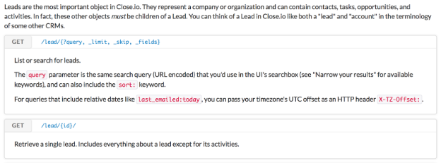

[](https://www.workato.com)

# Introduction

Welcome to the Workato Developer Program website. Here you will find the documentation you need to build application adapters using our SDK.

Alternatively, Workato offers a [HTTP Connector](http://bit.ly/WorkatoHTTPConnector) where you can create your own app connectors without having to code.

## Recipe

A Workato recipe is a set of predefined instructions to be executed. It is made up of a trigger and one or more actions.

It execute a variety of tasks to all the applications supported by the Workato platform.

## Trigger

Defines an event that triggers the execution of a Workato recipe

## Action

Steps that will be executed when a recipe is triggered.

There are 4 types of actions:

1. **Action**
  - Basic actions perform tasks like Search, Create, Update
2. **Conditional action**
  - These actions behave like traffic control. They provide users with the capability to restrict certain actions based on conditions.
  - Example: Create a new Account only if it does not already exist
3. **Repeat action**
  - Repeat actions are simple loops. They perform predefined tasks multiple times based on an array (list) of records.
  - Example: Add line items in QuickBooks for each opportunity item in Salesforce
4. **Stop**
  - Allows users to terminate a run of the recipe (a job). This is useful if you wish to stop performing any actions if a certain condition is met.
  - Optionally, you can define an error for this action. What this does is let you generate exceptions in certain scenarios. These jobs that stops with errors will show up in job history as errors

## Adapter

An Adapter is a connector to an application. Each Adapter has one or more trigger and actions. When an action or trigger is executed, it performs it's respective function with the account instance connected to that application.

# Connector SDK

## Custom Adapters

Connectors built on the SDK are called **custom adapters**. These connectors have private scope. This means that they are only available to the connector owner.

To enable global scope for this connector, the code will need to go through review by the Workato team. You can begin this process by submitting a pull request to our [repository](https://github.com/workato/custom_connector_docs).

## Requirements

### Format

Presently, we support the following types:
  - JSON
  - XML

### Bonus

#### Pagination

Pagination helps with response data that is more manageable. It is definitely a bonus if the intended API supports that.

#### Query

It is very useful to be able to query resources instead of locating them based on IDs. With Search by query, the API allows you to return a list of results that matches your field criterias. You may also want to look out for the ability to query based on created/updated time which will be crucial when building out your triggers.

## Authentication

### Basic Authentication

#### Standard

Typically, a basic authentication requires a username and password combination when making requests. Make sure to include those two fields in the connection fields definition.

```ruby
connection: {

  fields: [
    {
      name: "username",
      hint: "Your email used for login"
    },
    {
      name: "password",
      optional: false,
      control_type: "password",
    }
  ],

  authorization: {
    type: "basic_auth",

    credentials: lambda do |connection|
      user(connection["username"])
      password(connection["password"])
    end
  }
}
```

To set up a basic authentication, simply define type: 'basic_auth' and include the appropriate values in `user()` and `password()` in the credentials section. All requests made through the connector will contain the values defined in credentials.

#### Variations

Some APIs expect different conventions from a standard basic authentication.

```ruby
connection: {
  fields: [
    {
      name: "api_key",
      optional: false,
      hint: "Profile (top right) > Settings > Your API Keys"
    }
  ],

  authorization: {
    type: "basic_auth",

    # close.io uses api key only for authentication. treats apikey as username and password left blank
    # curl -u "{your api_key}:" "https://app.close.io/api/v1/me/"
    credentials: lambda do |connection|
      user(connection["api_key"])
      password("")
    end
  }
}
```

In this example, Close.io API expects an API Key generated in the individual User’s account. It should be used as a username with a blank password in the standard basic authentication format.

So, to adjust the connections portion of the code to suit this behaviour, simply request for an API instead of username + password.

In the credentials section, pass the api_key into `user()` and an empty string (“”) to `password()`

```ruby
connection: {

  fields: [
    {
      name: "api_token",
      control_type: "password",
      label: "API token",
      optional: false,
      hint: "Available in 'My Profile' page"
    }
  ],

  authorization: {
    type: "basic_auth",

    # Toggl API expect the token to be sent as user name and the string 'api_token' as the password
    # curl -u "{your api_token}:api_token" "https://www.toggl.com/api/v8/me"
    credentials: lambda do |connection|
      user(connection["api_token"])
      password("api_token")
    end
  }
}
```

Another variation is to have a generated api_token replace the user name and have the string “api_token” replacing password in the basic authentication format.

### API Key Authentication

For APIs that expect API Key authentication, it is a slight variation from the basic authentication code above.

Make sure to include the required inputs from the user (subdomain, api_key, scope etc)

Define
1. type: "api_key"
2. the appropriate parameter name for the api_key. In this case, it is simply "api_key"

After defining this, calls will have the appropriate params appended.

Example:
`<BASE_URL>/users?api_key=NB674921`

```ruby
connection: {

  fields: [
    {
      name: "helpdesk",
      control_type: "subdomain",
      url: ".freshdesk.com",
      optional: false,
      hint: "Your helpdesk name as found in your Freshdesk URL"
    },
    {
      name: "api_key",
      control_type: "password",
      optional: false,
      label: "API key"
    }
  ],

  authorization: {
    type: "api_key",

    credentials: lambda do |connection|
      params(api_key: connection["api_key"])
    end
  }
}
```

### OAuth 2.0

For a more secure method of authentication, we recommend using [OAuth 2.0](https://tools.ietf.org/html/rfc6749). It is an open standard and is generally a more secure way for users to log into third party websites without exposing their credentials.

```ruby
connection: {

  authorization: {
    type: "oauth2",

    authorization_url: lambda do
      "https://www.pushbullet.com/authorize?response_type=code"
    end,

    token_url: lambda do
      "https://api.pushbullet.com/oauth2/token"
    end,

    client_id: "YOUR_PUSHBULLET_CLIENT_ID",

    client_secret: "YOUR_PUSHBULLET_CLIENT_SECRET",

    credentials: lambda do |connection, access_token|
      headers("Authorization": "Bearer #{access_token}")
    end
  }
}
```

The Workato connector SDK currently supports the [Authorization Code Grant](https://tools.ietf.org/html/rfc6749#section-4.1) variant of the OAuth2 standard.

Required components in OAuth 2.0 type connection:

1. type (use 'oauth2')
2. authorization_url
3. token_url
4. client_id and client_secret
5. credentials

Redirect URI will be appended to the authorization request by the framework, so there is no need to include it. If the application requires that you register the redirect URI beforehand, use:
https://www.workato.com/oauth/callback

Adjust headers format as required in the credentials section

For example, Pushbullet expects the header to include token in this format:
`OAuth2: <access token>`

So to adjust to suit this requirement, define the credentials portion like so:

```ruby
connection: {

  authorization: {
    type: "oauth2",

    authorization_url: lambda do
      "https://podio.com/oauth/authorize"
    end,

    token_url: lambda do
      "https://podio.com/oauth/token"
    end,

    client_id: "YOUR_PODIO_CLIENT_ID",

    client_secret: "YOUR_PODIO_CLIENT_SECRET",

    credentials: lambda do |connection, access_token|
      headers("Authorization": "OAuth2 #{access_token}")
    end
  }
}
```

Note:

- SDK makes a POST request to token endpoint. Will not currently work for APIs expecting a different type of request.
- Ensure that your implementation of OAuth 2.0 is compliant with the specifications stated in the RFC document. Else, your custom adapter might not start.
  - For example, [Issuing an Access Token - Successful Response](https://tools.ietf.org/html/rfc6749#section-5.1) states that Workato will be expecting a response with the following required parameters: `access_token`, `token_type` and `expires_in`. Returning the access token with a key of `accessToken` in a JSON response will result in an unsuccessful Workato request to your `token_url`.
  - Usually this will not be a problem because most OAuth libraries out there will do most of the heavily-lifting for you, such as returning response in the right format etc. It is good to be aware of this!

### Custom Authentication


## Action

### Endpoints

An action can make one or more requests to various endpoints. Because the framework handles the authentication side of a request, you will not have to worry about that here.

The most important thing is to identify which endpoint will address the purpose of the action. Here we will take a look at Close.io's Lead object and how to retrieve it via the API.



```ruby
actions: {

  get_lead_by_id: {

    input_fields: lambda do
      [
        { name: "lead_id", optional: false }
      ]
    end,

    execute: lambda do |connection, input|
      get("https://app.close.io/api/v1/lead/#{input["lead_id"]}/")
    end,

    output_fields: lambda do |object_definitions|
      object_definitions["lead"]
    end
  }
}
```

A very simple action looks like this. A get request to the Close.io leads endpoint. In this case, the particular lead’s details is appended in the endpoint.

### Parameter / Payload

Other endpoints require parameters to access certain details, instead of accessing a particular resource route.

A GET request can have parameters added to the request like so:

```ruby
execute: lambda do |connection, input|
  {
    'companies': get("https://#{connection['deployment']}.api.accelo.com/api/v0/companies.json").
                 params(_search: input["company_name"])["response"]
  }
end
```

A POST or PUT or PATCH request can have payloads attached as well. There are 2 ways you can do this.

Add payloads to the method

```ruby
execute: lambda do |connection, input|
  {
    "users": get("https://#{connection['helpdesk']}.freshdesk.com/api/users.json", input)["results"]
  }
end
```

Add payloads using the payload method

```ruby
execute: lambda do |connection, input|
  post("https://api.pushbullet.com/v2/pushes").
    payload(
      email: input["email"],
      title: input["title"],
      body: input["body"]
    )
end
```

### Methods

Not all ruby public instance methods are available. Methods are whitelisted to ensure security. The Workato SDK Framework also exposes some methods to make building SDKs convenient.


Here is a list of methods available:

REST verb methods
- get(url, input)
- post(url, input)
- put(url, input)
- patch(url, input)

Note:

- `input` is actually a Ruby Hash that will be converted to JSON by the Connector SDK. Also, since `input` is the last argument of the method, we can optionally omit the curly braces.

Method | Description
--- | ----------
each | Basic iterator<br>`[1, 2, 3].each { |i| puts i }`
group_by | [Group arrays into sets](http://apidock.com/rails/Enumerable/group_by)
headers | Add headers to a request<br>`.headers(Authorization: "Bearer HTB674HJK1")`
params | Add parameter to a request<br>`.params(api_key: "HTB674HJK1")`
payload | Add payload to a request<br>`.payload(id: "345")`
ignored | Ignore a comma-separate list of fields<br>`object_definition["user"].ignored("id", "created_at")`
only | White list a comma-separate  of fields<br>`object_definition["user"].only("id", "name")`
required | Make a comma-separate list of fields required<br>`object_definition["user"].required("id", "created_at")`
inject | [Combine elements in an array using an operation](http://apidock.com/ruby/Enumerable/inject)
iso8601 | Convert a date/date-time variable to ISO8601 format
map | Returns a new array after invoking block on each element
merge | Returns a new hash containing [merged contents](https://ruby-doc.org/core-2.2.0/Hash.html#method-i-merge) of another hash
pluck | Select one or more attributes from an array of objects<br>`[{"id": 1, "name": "David"},{"id": 2, "name": "Peter"}].pluck("id")` returns `[1, 2]`
rand | Random number between 0 and 1
select | [Selectively returns](http://apidock.com/ruby/v1_9_3_392/Array/select) elements for which the block returns true
reject | [Selectively returns](http://apidock.com/ruby/v1_9_3_392/Array/reject) elements for which the block returns false (similar but opposite of select)
sort | [Sort function](http://apidock.com/ruby/Array/sort) returning new sorted array
sort_by | [Sort function](http://apidock.com/ruby/v1_9_3_392/Array/sort_by) returning self
utc | Convert Time to [utc](http://ruby-doc.org/core-2.2.0/Time.html#method-c-utc)
puts | ruby version of console.log/stdout, not the same as put
while | [while loop statement](https://www.tutorialspoint.com/ruby/ruby_loops.htm)

(This list can and will be expanded constantly, feel free to contact [me](eeshan@workato.com) to update/add to this list)

## Poll Trigger

Records (tickets, leads, items etc.) are called events in a poll. A poll trigger constantly executes a poll block for new events at fixed time intervals. This time interval depends on a user's subscription (5 or 10 minutes). At the same time, it is also able to support pagination. This is useful to prevent request timeouts when making requests with large response results. A trigger can execute immediate consecutive polls to retrieve events from successive pages.

There are two types of trigger. The classic trigger type is used by default if `type` is not specified. The other type is called the "paging_desc" trigger, which can be used only for endpoints that provide events sorted in descending order. This trigger type has an auto-paging mechanism that lets you build a simple and efficient trigger. (described in detail below)

A ruby hash is returned in each poll. This hash should contain a few keys. The array of events, or data, should be passed into the `events` key. At the same time, a cursor is saved in `next_page`/`next_poll` (depending on the trigger type). This cursor provides information about where the current poll stopped, and used in the next poll. A classic type trigger has an additional key `can_poll_more`, which can be defined to conditionally fire immediate polls for multi-page results.

### Classic Trigger
No need to define any type to use the classic trigger. This type is usually used for APIs that only return responses sorted in ascending order.

```ruby
updated_ticket: {
  input_fields: lambda do
    [
      {
        name: 'since',
        type: :timestamp,
        optional: false
      }
    ]
  end,

  poll: lambda do |connection, input, last_updated_since|
    page_size = 100
    updated_since = (last_updated_since || input['since']).to_time.utc.iso8601

    tickets = get("https://#{connection['helpdesk']}.freshdesk.com/api/v2/tickets.json").
              params(order_by: 'updated_at',
                     order_type: 'asc',
                     per_page: page_size,
                     updated_since: updated_since)

    next_updated_since = tickets.last['updated_at'] unless tickets.blank?

    {
      events: tickets,
      next_poll: next_updated_since,
      can_poll_more: tickets.length >= page_size
    }
  end,

  dedup: lambda do |ticket|
    ticket['id']
  end,

  output_fields: lambda do |object_definitions|
    object_definitions['ticket']
  end
}
```

#### poll
##### Arguments
A poll block is given 3 arguments.

The first argument is `connection`, used to access inputs from connection field values. This is frequently used to access domain or subdomain information from the user.

`input` provides access to trigger input field values from the recipe. Inputs like "created_since" a particular date is usually used in a trigger to allow filtering historic records. In this case, Knack does not provide filtering by record created dates, input is given an empty array.

The last argument, usually given the name `last_updated_since` or `last_created_since`, is the cursor "stored" from a previous poll. This is crucial to a good trigger design. It is used to determine where the last poll stopped and where to begin next. As an example, it is usually given the last (latest) "updated"/"created" time. When the trigger is first started, this value is `nil`.

##### Output
```ruby
poll: lambda do |connection, input, last_updated_since|
  page_size = 100
  updated_since = (last_updated_since || input['since']).to_time.utc.iso8601

  tickets = get("https://#{connection['helpdesk']}.freshdesk.com/api/v2/tickets.json").
            params(order_by: 'updated_at',
                   order_type: 'asc',
                   per_page: page_size,
                   updated_since: updated_since)

  next_updated_since = tickets.last['updated_at'] unless tickets.blank?

  {
    events: tickets,
    next_poll: next_updated_since,
    can_poll_more: tickets.length >= page_size
  }
end
```

In a classic type trigger, the expected output contains `events`, `next_poll` and `can_poll_more`.

`events` expects an array of individual results to be processed through the recipe as individual events.

`next_poll` is a cursor that will be passed on to the successive poll (third argument of `poll` block.

**Important**:
This trigger type does not have automatic-immediate polling. Immediate polling is determined by `can_poll_more`, which is a boolean value for whether an immediate poll should be made.

Example JSON response:
```ruby
[
  {
    "id": 1,
    "updated_at": "2016-08-13T00:53:44Z"
  },
  {
    "id": 2,
    "updated_at": "2016-09-14T02:25:00Z"
  },
  ...
]
```

When a get request receives this JSON response, it looks up the array for the last record (latest record) and passes it as the cursor for the next poll. It also checks the response array size. If it is equal to the size limit, it is likely that there are more records matching this request in consequtive pages. Hence the expression given to `can_poll_more` evaluates to true and invokes an immediate successive poll. This loop continues until response array size is smaller than page limit.

At the end of the loop. The last (latest) created date is passed as `next_poll`. This value will be used in the next poll cycle to pick up new records.

#### dedup

Dedup block is used to identify individual events. It is given a single argument "event", which corresponds to individual elements in the records array passed into "events".

A typical dedup input is `event[‘id’]` where the `event` argument name can be replaced to make the code more readable. This should be used only in classic triggers.
```ruby
dedup: lambda do |ticket|
  ticket["id"]
end
```
In some instances, a record needs to be proccessed as separate events. A typical scenario is updated records. To do this, append updated timestamp field to the dedup expression like so.
```ruby
dedup: lambda do |ticket|
  ticket["id"] + "@" + ticket["`updated_at"]
end
```
With this, 2 occurence of a record with the same "ID" but with different "updated_at" values will be recorded as separate events.

### Descending Trigger
```ruby
new_alert: {
  type: :paging_desc,

  input_fields: lambda do
    [
      {
        name: 'since',
        type: :timestamp,
        optional: false
      }
    ]
  end,

  poll: lambda do |connection, input, page|
    limit = 100
    page ||= 0
    created_since = (input['since'] || Time.now).to_i
    offset = (limit * page)

    response = get("https://api.pingdom.com/api/2.0/actions").
                 params(from: created_since,
                        limit: limit,
                        offset: offset)

    {
      events: response,
      next_page: (response.length >= limit) ? page + 1 : nil
    }
  end,

  document_id: lambda do |response|
    response['checkid']
  end,

  sort_by: lambda do |response|
    response['time']
  end,

  output_fields: lambda do |object_definitions|
    object_definitions['alert']
  end
}
```

#### type
`type: :paging_desc` - This type should be used only if results are in descending order. A `paging_desc` trigger works by assuming a descending order and continuously poll for all unique records. If the API is unable to return records in descending order, ignore this key to use the classic trigger.

A record of all event IDs (defined in `document_id` ) is recorded for each recipe. Each recipe will "remember" all event IDs that is processed through a trigger.

Based on assumption of order, the trigger can stop the polling cycle once a similar event IDs is observed. This is because further polls will return events "before" and would have already been processed by the trigger. At this point, the trigger stops polling and wait for the new poll cycle for new events. The Workato trigger framework handles deduplication in the background.

#### poll
Poll block is where you define how events are obtained. Typically, a GET request is used to retrieve a list of records to be processed as trigger events.

##### Arguments
Descending trigger `poll`s have the exact same argument structure. `connection`, `input` and `cursor`. The one difference is that the last argument is usually given the name `page`. In a descending trigger, this argument is usually used to pass the page number instead of record timestamp.

##### Output
Similar to a classic trigger, the `events` in output here expects an array of results.

```ruby
poll: lambda do |connection, input, page|
  limit = 100
  page ||= 0
  created_since = (input['since'] || Time.now).to_i
  offset = (limit * page)

  response = get("https://api.pingdom.com/api/2.0/actions").
               params(from: created_since,
                      limit: limit,
                      offset: offset)

  {
    events: response,
    next_page: (response.length >= limit) ? page + 1 : nil
  }
end
```

Instead of `next_poll`, `paging_desc` type trigger should be given `next_page` as cursor. It is used for passing the next page to be polled.

A typical response looks like this.

```ruby
{
  "current": "https://api.sample.com/records?order=desc&from=2016-12-09T22%3A57%3A13Z&page=1",
  "next": "https://api.sample.com/records?order=desc&from=2016-12-09T22%3A57%3A13Z&page=2",
  "data: [
    {
      "checkid": 123,
      "time": "2016-12-13T19:09:01Z",
      ...
    },
    {
      "checkid": 124,
      "time": "2016-12-10T06:20:00Z",
      ...
    }
  ]
}
```

`response["data"]` is an array of results from the request, which should be passed to `events`. While it varies between APIs, most will provide some form of pointer to the next page of results. In this example,`response["next"]` is an API generated url to be used to retrieve the next page of results matching the request. Hence we can simply pass it to `next_page`. In the successive poll, this value is passed to the poll block and the next set of records is retrieved.

On the last page, `response["next"]` is usually `null`. In that case, it will cause the successive poll to make the same request as in the first page. When this happens, the trigger framework detects a duplicate event (mechanism for detection explained in detail later) and halts all immediate polls. At this point, the trigger goes to "sleep" until the next poll cycle.

New records being added in the cloud instance will appear in the first page of requests since records are returned in descending order. The trigger picks up new records and processes them until a duplicate event is detected, at which point it "sleeps". This trigger type depends on a descending order to retrieve only "new" records and stops upon detection of "old" records.

This way, the trigger polls for new records efficiently, without making any repeated requests to retrieve the entire set of records in each poll cycle.

### document_id
Similar to `dedup`, `paging_desc` type triggers uses `document_id` to identify unique records. Write an expression that can uniquely identify the "ID" of records.

```ruby
document_id: lambda do |event|
  event["checkid"]
end
```

Unlike classic triggers, there is no need to include timestamp fields into the `document_id` expression to deduplicate updated records. Descending triggers have an additional block `sort_by` to process this.

### sort_by
In addition to `document_id`, this block is used to define the field that is used to sort records (in descending order). It could be "created_at" or "updated_at" or similar fields.

```ruby
sort_by: lambda do |event|
  eent["time"]
end
```

## Webhook Trigger

```ruby
triggers: {
  new_message: {
    type: :paging_desc,

    input_fields: lambda do |object_definitions|
      object_definitions["room"].only("id")
    end,

    webhook_subscribe: lambda do |webhook_url, connection, input, recipe_id|
      post("https://api.ciscospark.com/v1/webhooks",
           name: "Workato recipe #{recipe_id}",
           targetUrl: webhook_url,
           resource: "messages",
           event: "created",
           filter: "roomId=#{input['id']}")
    end,

    webhook_notification: lambda do |input, payload|
      payload["data"]
    end,

    webhook_unsubscribe: lambda do |webhook|
      delete("https://api.ciscospark.com/v1/webhooks/#{webhook['id']}")
    end,

    dedup: lambda do |message) {
      message["id"]
    end,

    output_fields: lambda do |object_definitions|
      object_definitions["message"]
    end
  }
}
```

### webhook_subscribe

This block is called when the recipe is being started to run necessery API calls to subscribe for further webhook notifications. The endpoint that supposed to be register is passed in `webhook_url` parameter with other data that could be useful while registering the webhook.

### webhook_unsubscribe

This block will be called after recipe start to unsubscribe from webhook notifications.

### webhook_notification

POST/PUT HTTP requests can be used to notify about new trigger events. JSON-encoded payload is expected. This block is called to extract trigger output data from webhook notification payload (`payload` attribute). Original trigger input is also available in this block (`input` attribute)

## Object Definition

Object Definitions is an important component of the SDK. It allows you to define your schema for objects to be used in the actions and triggers. It allows you to easily define outputs and inputs later on.

### Static Definition

The most basic way to build an object definition is to define the field name and type

```ruby
object_definitions: {
  push: {
    fields: lambda do
      [
        { name: "active", type: :boolean },
        { name: "body" },
        { name: "created" },
        { name: "direction" },
        { name: "dismissed", type: :boolean },
        { name: "iden" },
        { name: "modified" },
        { name: "receiver_email" },
        { name: "receiver_email_normalized" },
        { name: "receiver_iden" },
        { name: "sender_email" },
        { name: "sender_email_normalized" },
        { name: "sender_iden" },
        { name: "sender_name" },
        { name: "title" },
        { name: "type" },
      ]
    end
  }
}
```

In this example, the object “Push” is being defined in the fields lambda literal.

Defined as an array of objects. Each field object corresponds to a field in the comment object.

### Dynamic Definition

```ruby
object_definitions: {

  form: {
    fields: lambda do |connection|
      get("https://api.unbounce.com/pages/#{connection['page_id']}/form_fields")["formFields"].
        map { |field| { name: field["id"] } }
    end
  }
}
```

### Components

Key | Definition
--- | ----------
name | The name of this field. For example `id` or `created_at`
type | The data type of this field. Default value is string
control_type | The input field type to expose in a recipe.
pick_list | If control type is 'select', this component is  required. See more in **Pick List**
properties | When defining nested objects, use the properties key to define the fields in the object. Remember to define the type as `:array` or `:object`

#### type
It should be given the symbol notation (prepend colon)

Supported types:
`:string`, `:integer`, `:datetime`, `:date`, `:boolean`, `:object`, `:array`

`:object`, and `:array` must be accompanied with properties

#### control_type

Some of the available values are
url: the data field will show a link
select: the data field will be a pick list (make sure to include the pick_list property

Other supported types:
timestamp, checkbox, phone, email, text, number, text-area

## Test

Test endpoint to ensure that connection is successful.

Typically, this should be a request that will always be accessible to any user.

Here are some examples:

```ruby
test: lambda do |connection|
  get("https://person.clearbit.com/v1/people/email/eeshansim@gmail.com")
end
```

```ruby
test: lambda do |connection|
  get("https://app.clicktime.com/api/1.3/session")
end
```

## Pick List
A pick list is list of choices predefined for a user to select instead of having to input the actual values.
It is useful when there is a list of accepted values for a field or when the field requires a value that is not visible. For example, a field that requires User ID will require a pick list that displays the User names and pass the corresponding User's ID to that field.

### Defining a pick list
There are 2 ways to define a pick list: dynamically or statically.

Static example:

Pick list is defined as a array of selections. Each selection is an array made up of 2 elements.

The first element in the selection array is the value displayed and the second element is the value of that selection.
```ruby
pick_lists: {
  folder: lambda do |connection|
    [
      # Display name, value
      ["Root","111390"],
      ["Recycle Bin","235611"]
    ]
  end
}
```

Dynamic example:
```ruby
pick_lists: {
  folder: lambda do |connection|
    get("https://www.wrike.com/api/v3/folders")["data"].
      map { |folder| [folder["title"], folder["id"]] }
  end
}
```
After making a GET requests for all folders available, the pick list is populated with folder `id`s and displays the corresponding folder `title`

### Usage
```ruby
input_fields: lambda do |object_definitions|
  [
    { name: "folder_id", control_type: "select", pick_list: "folder" }
  ]
end
```

## Configuration Fields

Occassionally, input/output fields depend on user input. For example, the fields for an object depends on the chosen object. Here, we introduce `config_fields`. It is an optional key available in both actions and triggers. It is a special type of input field that can be used to generate other dependent input/output fields. We see this in the merge_document action in Webmerge.

```ruby
action: {
  merge_document: {
    config_fields: [
      # this field shows up first in recipe as a picklist of documents to use
      {
        name: "document_id",
        label: "Document",
        control_type: :select,
        pick_list: "documents",
        optional: false
      }
    ],

    input_fields: lambda do |object_definition|
      object_definition["document"]
    end,

    execute: lambda do |_connection, input|
      d = input["document_id"].split("|")
      post(d.last.to_s, input)
    end,

    output_fields: lambda do |_object_definition|
      [
        {
          name: "success"
        }
      ]
    end
  }
}
```

Here, the fields are different for each document, hence a user first chooses a document (from a pick list of documents available in the instance) which is then used to generate the remaining fields. This part is done by specifying that the "document" object definition is dependent on the value of "document_id" within config_field. Notice that the fields block accepts a second argument `config_fields`. This argument refers to the field(s) you define in `config_fields` in each action/trigger.

```ruby
object_definition: {
  document: {
    fields: lambda do |_connection, config_fields|
      return [] if config_fields.blank?
      get("https://www.webmerge.me/api/documents/#{config_fields["document_id"]}/fields").
        map { |field| field.slice("name") }
    end
  }
}
```

While the config_fields is empty, document objects will have no fields (empty array of fields). As soon as config_fields is given a value, a request is made to retrieve the fields present in this document. From a recipe user perspective, the action will appear initially as a single input with a list of documents. After selecting a document, the corresponding set of fields will be generated, to be used in the recipe.

# Example Adapters

## Basic Authentication Samples
- [Harvest app connector](https://github.com/workato/custom_connector_docs/blob/master/custom_connectors/basic_auth/harvest_connector.rb)

- [On-prem Security connector](https://github.com/workato/custom_connector_docs/blob/master/custom_connectors/basic_auth/onprem_security.rb)

- [Freshdesk connector](https://github.com/workato/custom_connector_docs/blob/master/custom_connectors/basic_auth/freshdesk_connector.rb)

- [Clearbit connector](https://github.com/workato/custom_connector_docs/blob/master/custom_connectors/basic_auth/clearbit_connector.rb)

- [Close.io connector](https://github.com/workato/custom_connector_docs/blob/master/custom_connectors/basic_auth/close_io_connector.rb)

- [Click Time connector](https://github.com/workato/custom_connector_docs/blob/master/custom_connectors/basic_auth/click_time_connector.rb)

- [Toggl connector](https://github.com/workato/custom_connector_docs/blob/master/custom_connectors/basic_auth/toggl_connector.rb)

- [Unbounce connector](https://github.com/workato/custom_connector_docs/blob/master/custom_connectors/basic_auth/unbounce_connector.rb)

- [Watson Tone Analyzer connector](https://github.com/workato/custom_connector_docs/blob/master/custom_connectors/basic_auth/watson_tone_analyzer_connector.rb)

- [Docparser connector](https://github.com/workato/custom_connector_docs/blob/master/custom_connectors/basic_auth/docparser_connector.rb)

## OAuth2 Samples
- [Podio connector](https://github.com/workato/custom_connector_docs/blob/master/custom_connectors/oauth2/podio_connector.rb)

- [ProductHunt connector](https://github.com/workato/custom_connector_docs/blob/master/custom_connectors/oauth2/producthunt_connector.rb)

- [Accelo connector](https://github.com/workato/custom_connector_docs/blob/master/custom_connectors/oauth2/accelo_connector.rb)

- [Pushbullet connector](https://github.com/workato/custom_connector_docs/blob/master/custom_connectors/oauth2/pushbullet_connector.rb)

- [Wrike connector](https://github.com/workato/custom_connector_docs/blob/master/custom_connectors/oauth2/wrike_connector.rb)

- [Cisco Spark connector](https://github.com/workato/custom_connector_docs/blob/master/custom_connectors/oauth2/cisco_spark_connector.rb)

- [AMcards connector](https://github.com/workato/custom_connector_docs/blob/master/custom_connectors/oauth2/amcards_connector.rb)

- [Wachete connector](https://github.com/workato/custom_connector_docs/blob/master/custom_connectors/oauth2/wachete_connector.rb)

## API Key Authentication Samples
- [Gender API connector](https://github.com/workato/custom_connector_docs/blob/master/custom_connectors/api_key_auth/gender_api_connector.rb)

- [Hipchat connector](https://github.com/workato/custom_connector_docs/blob/master/custom_connectors/custom_auth/hipchat_connector.rb)

- [Codeship connector](https://github.com/workato/custom_connector_docs/blob/master/custom_connectors/api_key_auth/codeship_connector.rb)

## Custom Authentication Samples
- [LoJack app connector](https://github.com/workato/custom_connector_docs/blob/master/custom_connectors/custom_auth/lo_jack_connector.rb)

- [SafetyCulture app connector](https://github.com/workato/custom_connector_docs/blob/master/custom_connectors/custom_auth/safetyculture_connector.rb)

- [Knack HQ connector](https://github.com/workato/custom_connector_docs/blob/master/custom_connectors/custom_auth/knack_hq_connector.rb)

- [Neto connector](https://github.com/workato/custom_connector_docs/blob/master/custom_connectors/custom_auth/neto_connector.rb)

- [TSheets connector](https://github.com/workato/custom_connector_docs/blob/master/custom_connectors/custom_auth/tsheets_connector.rb)
